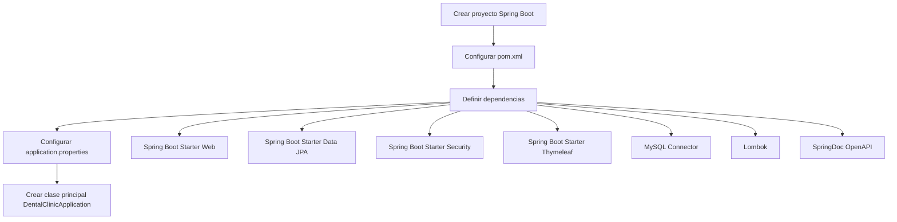
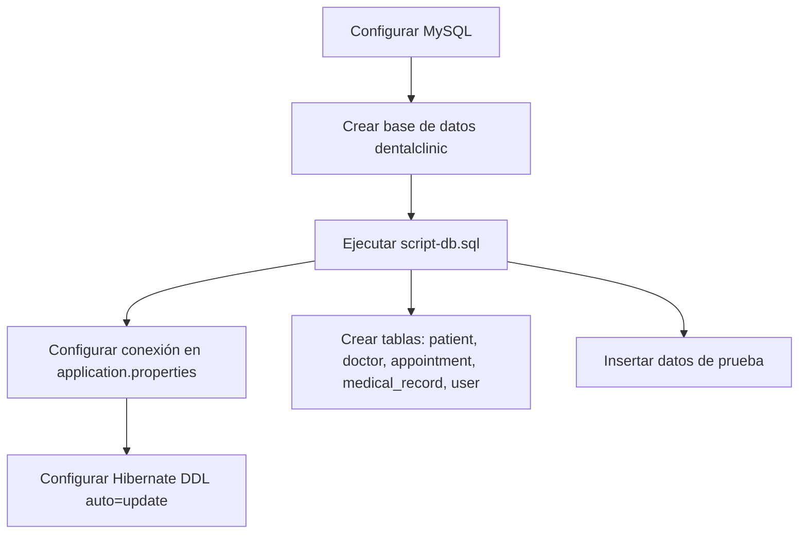
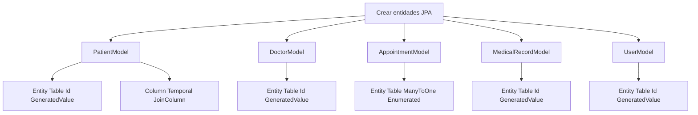
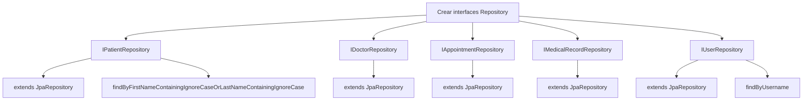
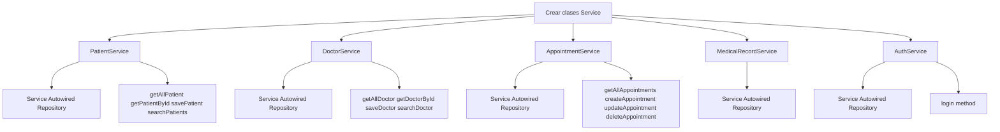
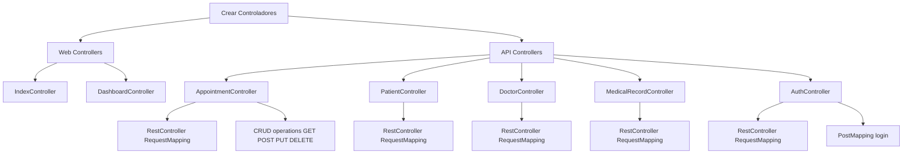
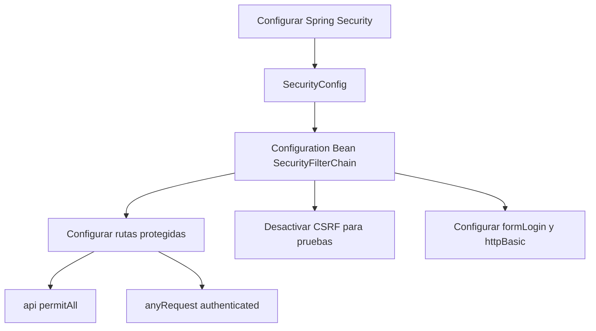
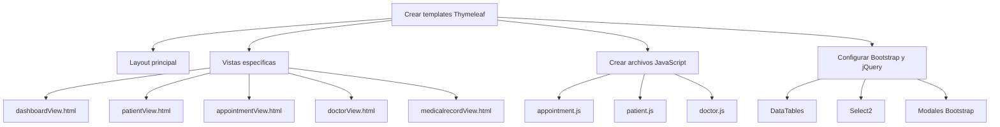
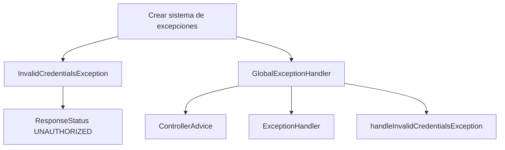
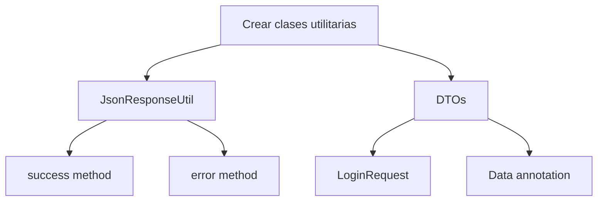

# 🏥 Diagrama de Construcción del Sistema Dental en Java

## 📋 Resumen del Sistema
**Sistema de Gestión de Clínica Dental** - Aplicación web desarrollada con Spring Boot 3.4.2, Java 21, MySQL y arquitectura MVC.

---

## 🏗️ Arquitectura del Sistema

```
┌─────────────────────────────────────────────────────────────┐
│                    PRESENTATION LAYER                       │
├─────────────────────────────────────────────────────────────┤
│  📱 Frontend (Thymeleaf + Bootstrap + jQuery)              │
│  ├── Templates HTML                                         │
│  ├── JavaScript (appointment.js, etc.)                     │
│  └── CSS/Static Resources                                   │
└─────────────────────────────────────────────────────────────┘
                              │
                              ▼
┌─────────────────────────────────────────────────────────────┐
│                     CONTROLLER LAYER                        │
├─────────────────────────────────────────────────────────────┤
│  🎮 Controllers                                            │
│  ├── Web Controllers (MVC)                                 │
│  │   ├── IndexController                                   │
│  │   ├── DashboardController                               │
│  │   └── [Otros Controllers Web]                           │
│  └── API Controllers (REST)                                │
│      ├── AppointmentController                             │
│      ├── PatientController                                 │
│      ├── DoctorController                                  │
│      ├── MedicalRecordController                           │
│      └── AuthController                                    │
└─────────────────────────────────────────────────────────────┘
                              │
                              ▼
┌─────────────────────────────────────────────────────────────┐
│                      SERVICE LAYER                          │
├─────────────────────────────────────────────────────────────┤
│  ⚙️ Business Logic                                         │
│  ├── AppointmentService                                    │
│  ├── PatientService                                        │
│  ├── DoctorService                                         │
│  ├── MedicalRecordService                                  │
│  └── AuthService                                           │
└─────────────────────────────────────────────────────────────┘
                              │
                              ▼
┌─────────────────────────────────────────────────────────────┐
│                     REPOSITORY LAYER                        │
├─────────────────────────────────────────────────────────────┤
│  🗄️ Data Access Layer                                      │
│  ├── IAppointmentRepository                                │
│  ├── IPatientRepository                                    │
│  ├── IDoctorRepository                                     │
│  ├── IMedicalRecordRepository                              │
│  └── IUserRepository                                       │
└─────────────────────────────────────────────────────────────┘
                              │
                              ▼
┌─────────────────────────────────────────────────────────────┐
│                      DATA LAYER                             │
├─────────────────────────────────────────────────────────────┤
│  💾 MySQL Database                                         │
│  ├── patient table                                         │
│  ├── doctor table                                          │
│  ├── appointment table                                      │
│  ├── medical_record table                                  │
│  └── user table                                            │
└─────────────────────────────────────────────────────────────┘
```

---

## 🔄 Flujo de Construcción Paso a Paso

### **FASE 1: Configuración Inicial** 🚀



### **FASE 2: Configuración de Base de Datos** 🗄️



### **FASE 3: Creación de Modelos (Entidades)** 📊



### **FASE 4: Creación de Repositorios** 🔍



### **FASE 5: Creación de Servicios** ⚙️



### **FASE 6: Creación de Controladores** 🎮



### **FASE 7: Configuración de Seguridad** 🔒



### **FASE 8: Creación de Frontend** 🎨



### **FASE 9: Manejo de Excepciones** ⚠️



### **FASE 10: Utilidades y DTOs** 🛠️



---

## 📦 Estructura Final del Proyecto

```
DentalClinic/
├── src/
│   ├── main/
│   │   ├── java/upn/pe/dentalClinic/
│   │   │   ├── DentalClinicApplication.java          # 🚀 Punto de entrada
│   │   │   ├── config/
│   │   │   │   └── SecurityConfig.java               # 🔒 Configuración de seguridad
│   │   │   ├── controller/
│   │   │   │   ├── web/                              # 🎮 Controladores MVC
│   │   │   │   │   ├── IndexController.java
│   │   │   │   │   └── DashboardController.java
│   │   │   │   └── api/                              # 🌐 Controladores REST
│   │   │   │       ├── AppointmentController.java
│   │   │   │       ├── PatientController.java
│   │   │   │       ├── DoctorController.java
│   │   │   │       ├── MedicalRecordController.java
│   │   │   │       └── AuthController.java
│   │   │   ├── service/                              # ⚙️ Lógica de negocio
│   │   │   │   ├── AppointmentService.java
│   │   │   │   ├── PatientService.java
│   │   │   │   ├── DoctorService.java
│   │   │   │   ├── MedicalRecordService.java
│   │   │   │   └── AuthService.java
│   │   │   ├── repository/                           # 🗄️ Acceso a datos
│   │   │   │   ├── IAppointmentRepository.java
│   │   │   │   ├── IPatientRepository.java
│   │   │   │   ├── IDoctorRepository.java
│   │   │   │   ├── IMedicalRecordRepository.java
│   │   │   │   └── IUserRepository.java
│   │   │   ├── model/                                # 📊 Entidades JPA
│   │   │   │   ├── AppointmentModel.java
│   │   │   │   ├── PatientModel.java
│   │   │   │   ├── DoctorModel.java
│   │   │   │   ├── MedicalRecordModel.java
│   │   │   │   └── UserModel.java
│   │   │   ├── dto/                                  # 📦 Objetos de transferencia
│   │   │   │   └── LoginRequest.java
│   │   │   ├── exception/                            # ⚠️ Manejo de excepciones
│   │   │   │   ├── InvalidCredentialsException.java
│   │   │   │   └── GlobalExceptionHandler.java
│   │   │   └── common/                               # 🛠️ Utilidades
│   │   │       └── JsonResponseUtil.java
│   │   └── resources/
│   │       ├── application.properties                # ⚙️ Configuración
│   │       ├── templates/                            # 🎨 Vistas Thymeleaf
│   │       │   ├── dashboardView.html
│   │       │   ├── patientView.html
│   │       │   ├── appointmentView.html
│   │       │   ├── doctorView.html
│   │       │   └── medicalrecordView.html
│   │       └── static/                               # 📱 Recursos estáticos
│   │           ├── css/
│   │           ├── js/
│   │           │   ├── logic/
│   │           │   │   ├── appointment.js
│   │           │   │   ├── patient.js
│   │           │   │   └── doctor.js
│   │           │   └── common.js
│   │           └── images/
│   └── test/                                         # 🧪 Pruebas unitarias
├── pom.xml                                           # 📦 Dependencias Maven
├── script-db.sql                                     # 🗄️ Script de base de datos
└── docker-compose.yml                                # 🐳 Configuración Docker
```

---

## 🎯 Tecnologías Utilizadas

| **Capa** | **Tecnología** | **Versión** | **Propósito** |
|----------|----------------|-------------|---------------|
| **Framework** | Spring Boot | 3.4.2 | Framework principal |
| **Lenguaje** | Java | 21 | Lenguaje de programación |
| **Base de Datos** | MySQL | 8.0+ | Persistencia de datos |
| **ORM** | Hibernate/JPA | 6.x | Mapeo objeto-relacional |
| **Frontend** | Thymeleaf | 3.x | Motor de plantillas |
| **UI Framework** | Bootstrap | 5.2.0 | Framework CSS |
| **JavaScript** | jQuery | - | Manipulación DOM |
| **Seguridad** | Spring Security | 6.x | Autenticación y autorización |
| **Documentación** | SpringDoc OpenAPI | 2.2.0 | Documentación API |
| **Build Tool** | Maven | - | Gestión de dependencias |
| **Lombok** | Lombok | - | Reducción de código boilerplate |

---

## 🚀 Comandos de Ejecución

```bash
# 1. Compilar el proyecto
mvn clean compile

# 2. Ejecutar la aplicación
mvn spring-boot:run

# 3. Acceder a la aplicación
http://localhost:8680

# 4. Acceder a Swagger UI
http://localhost:8680/swagger-ui

# 5. Ejecutar pruebas
mvn test
```

---

## 📊 Métricas del Proyecto

- **Líneas de código**: ~2,000+ líneas
- **Clases Java**: 20+ clases
- **Endpoints API**: 15+ endpoints REST
- **Vistas**: 5+ templates Thymeleaf
- **Entidades**: 5 entidades JPA
- **Servicios**: 5 servicios de negocio
- **Repositorios**: 5 interfaces de repositorio

---

## 🔄 Flujo de Desarrollo Recomendado

1. **Configurar entorno** (Java 21, Maven, MySQL)
2. **Crear proyecto Spring Boot** con dependencias básicas
3. **Configurar base de datos** y conexión
4. **Crear entidades JPA** para el modelo de datos
5. **Implementar repositorios** para acceso a datos
6. **Desarrollar servicios** con lógica de negocio
7. **Crear controladores** REST y MVC
8. **Configurar seguridad** y autenticación
9. **Desarrollar frontend** con Thymeleaf y JavaScript
10. **Implementar manejo de excepciones**
11. **Agregar documentación** con Swagger
12. **Realizar pruebas** y optimizaciones
13. **Desplegar** y monitorear

---

*Este diagrama representa la construcción paso a paso del sistema de gestión de clínica dental, siguiendo las mejores prácticas de desarrollo con Spring Boot y arquitectura en capas.* 